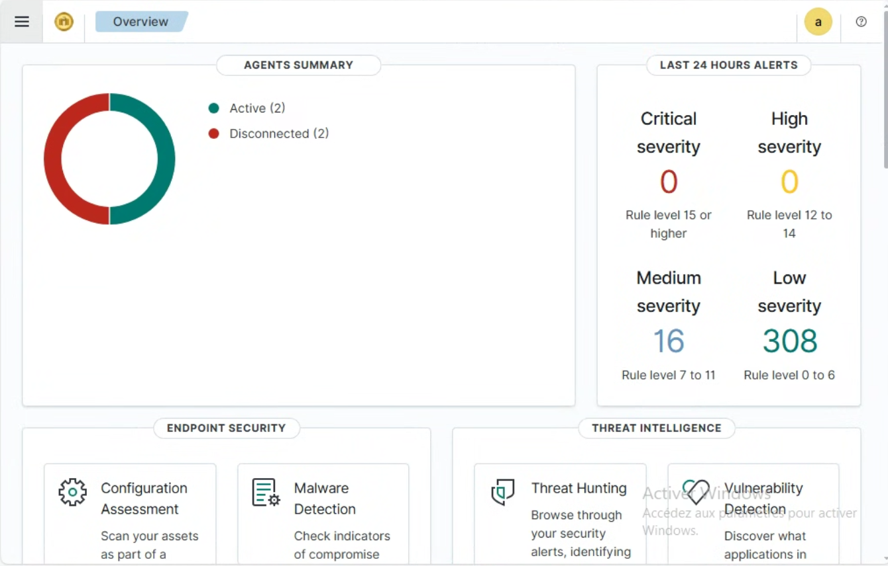
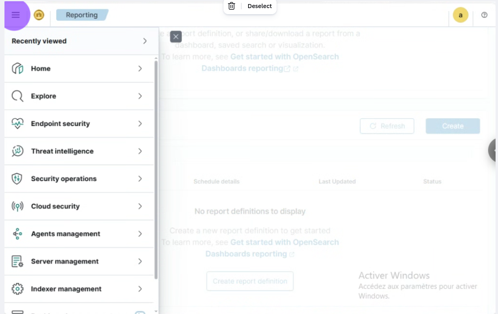
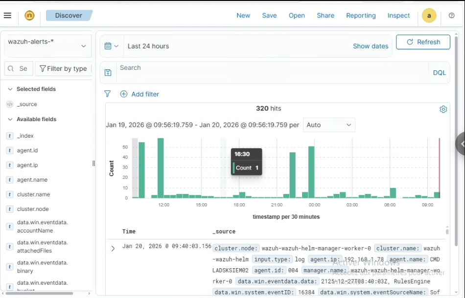
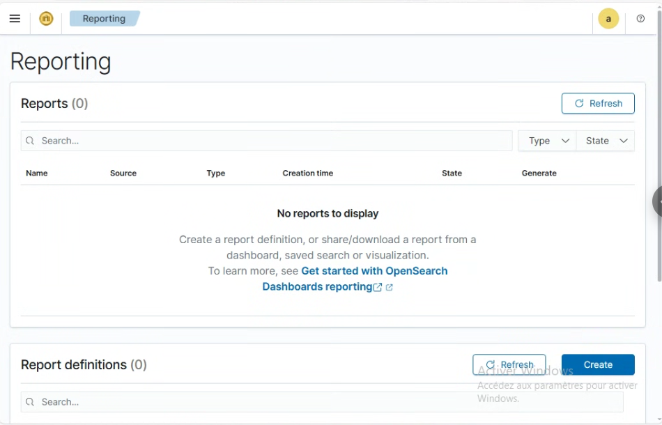
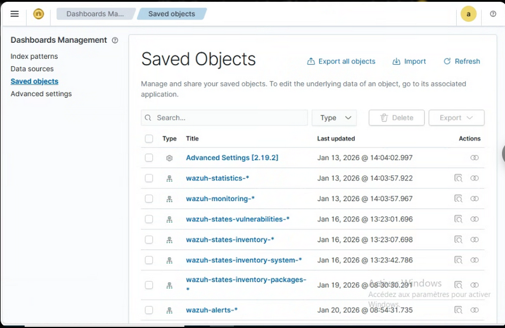

# SOC Analyst User Manual – Overview

This manual provides SOC Analysts with guidance on using the security monitoring platform for daily operations. It covers dashboard navigation, searches, reporting, and data exports to support security monitoring and incident response activities.

Screenshots are included to illustrate key functions and may vary slightly based on user role or system updates. Analysts must follow organizational policies when handling alerts, reports, and exported data.

# 1. The Overview Dashboard

This is the **Heads-Up Display** for the SOC team. It provides a high-level summary of the security state of your entire network.

**Alert Severity Monitoring:** This panel categorizes all security events triggered in the last 24 hours.

**Critical/High (Levels 12-15+):** These are priority-one threats that require immediate action.

**Medium (Levels 7-11):** Events like multiple failed logins or policy violations that need investigation.

**Low (Levels 0-6) :** Standard activity logs used for auditing and trend analysis.

#### a- Navigation Sidebar (Explore Menu)
**Discover:** Where you go to hunt for specific logs.

**Reporting:** Where you generate official documents for stakeholders.

**Agents:** Shows the health of the devices you are monitoring (e.g., if a server goes offline).

# 2. Wazuh Dashboard –  (Field-by-Field Explanation)

This screen belongs to **Wazuh Dashboard (OpenSearch Dashboards)** and shows the **Reporting** module with the left navigation menu expanded.

---

## 1. Left Sidebar (Main Navigation)

### Recently viewed
- Displays pages you accessed recently
- Provides quick navigation shortcuts

---

### Home
- Main landing page of Wazuh Dashboard
- Shows general system overview and shortcuts

---

### Explore
- Used to search, filter, and analyze logs
- Equivalent to OpenSearch **Discover**
- Common use cases:
  - Investigating alerts
  - Running queries
  - Applying filters (agent, rule ID, level, etc.)

---

### Endpoint security
- Focuses on endpoint-level protection
- Includes:
  - File Integrity Monitoring (FIM)
  - Malware detection
  - Rootcheck
  - Vulnerability detection
- Used to monitor host-based security events

---

### Threat intelligence
- Correlates events with known threat indicators
- Detects:
  - Malicious IPs
  - Known attack patterns
  - IOC-based detections

---

### Security operations
- Central Security Operations Center (SOC) view
- Used for:
  - Monitoring alerts
  - Incident investigation
  - Rule-based detections

---

### Cloud security
- Security monitoring for cloud platforms:
  - AWS
  - Azure
  - GCP
- Includes:
  - Cloud logs
  - Compliance and posture checks

---

### Agents management
- Used to manage Wazuh agents
- Functions include:
  - Viewing agent status
  - Checking last keepalive
  - Upgrading agents
  - Detecting disconnected agents

---

### Server management
- Administrative view for Wazuh managers
- Includes:
  - Cluster status
  - Manager health
  - API status

---

### Indexer management
- Manages OpenSearch indices
- Used for:
  - Index health monitoring
  - Shard allocation
  - Index pattern troubleshooting

---

## Summary Table

| Section | Purpose |
|--------|---------|
| Reporting | Create and manage scheduled/manual reports |
| Explore | Search and analyze logs |
| Endpoint security | Monitor endpoint threats |
| Security operations | SOC alert monitoring |
| Agents management | Manage Wazuh agents |
| Indexer management | Manage OpenSearch indices |

- **REF**:https://documentation.wazuh.com/current/user-manual/wazuh-dashboard/navigating-the-wazuh-dashboard.html

# 3. Searches (Discover View)

The Discover view allows SOC analysts to search, filter, and analyze security alerts collected by Wazuh. Searches are a core investigation tool used for incident response, threat hunting, rule validation, and reporting.

- **Index Pattern**
All searches are performed against the `wazuh-alerts-*` index pattern, which contains security alerts generated by Wazuh agents across the environment.

- **Time Range Selection**
The time picker limits search results to a specific period. Analysts must ensure the correct time range is selected when investigating incidents or validating alerts.

Common usage includes:
- Last 15 minutes: active incident response
- Last 24 hours: daily SOC review
- Custom range: forensic investigations

- **Searching and filtering**
The search bar supports structured queries to filter alerts by fields such as agent name, rule ID, severity level, event ID, or IP address.

Analysts can search specific fields using the format:

`field_name:value`

**Common fields:**

- agent.name

- agent.id

- rule.id

- rule.level

- data.srcip

- data.user

- **Filters**
Filters provide an intuitive way to narrow results without manual queries. Multiple filters can be combined and easily removed.

- **Event Timeline**
The histogram displays the number of alerts over time, helping analysts identify spikes, abnormal activity, or attack windows.

- **Event Details**
Each search result includes detailed alert information such as agent data, rule metadata, and the raw log. This information is used for root cause analysis, rule tuning, and evidence collection.

 Operational Use Cases
Searches are commonly used for:
- Incident investigation
- Threat hunting
- Rule testing and false-positive reduction
- Report generation and data export

**REF:** https://wazuh.com/blog/filtering-security-data-with-the-wazuh-query-language/

# 4. Reporting
**Overview**

The Reporting feature allows SOC analysts to transform security alerts and search results into structured reports for operational monitoring, incident response, compliance, and management visibility.

Reports are generated from:

- Saved searches

- Dashboards and visualizations

- Filtered alert data from the Discover view

### 4.1 Purpose of Reporting

Reports are used to:

Communicate incidents

Summarize security posture

Reports are typically generated from filtered views.

### 4.2 Creating Reports from Dashboards

Analysts can:

Use saved searches

Capture visualizations

Export tables

Reports are usually prepared externally (PDF, Excel, ticket systems).

**REF:** https://documentation.wazuh.com/current/user-manual/wazuh-dashboard/navigating-the-wazuh-dashboard.html

# 5. Exporting Data
**5.1 What Export Does**

The Export function allows analysts to download currently visible and filtered data.

Key characteristics:

- Manual, UI-based

- Honors filters and time range

**5.2 Export Formats**

Supported formats include:

- CSV: spreadsheets and reports

- JSON / NDJSON: automation and scripting

- PNG / PDF: charts and visual summaries

**5.3 Common Export Use Cases**

- Attach alert data to incident tickets

- Share findings with IR or management

- Provide audit evidence

- Exports are not suitable for automation or large datasets.

**REF:** https://documentation.wazuh.com/current/index.html