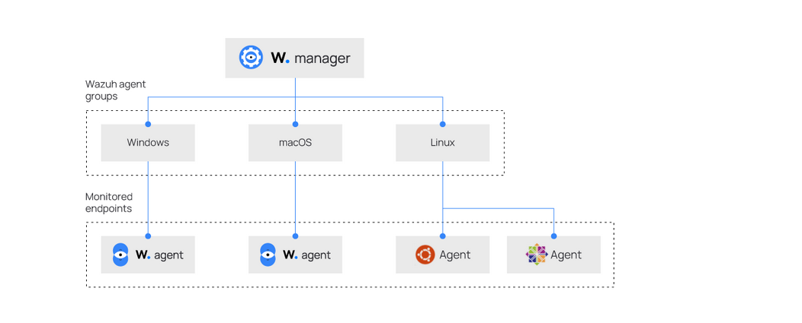

# **Wazuh Centralized Configuration Management Guide**

**Document Version:** 2.2
**Last Updated:** 2025-10-06

## **1. Introduction**

This guide explains how to manage Wazuh agent configurations using centralized configuration management. Instead of configuring each agent individually, you can define settings on the Wazuh manager and distribute them to agent groups.

*Reference: [Wazuh Agent Groups and Centralized Configuration Blog](https://wazuh.com/blog/agent-groups-and-centralized-configuration/)*

## **2. Architecture Overview**

### **2.1. Centralized Configuration Flow**

The diagram below illustrates the centralized configuration architecture. The Wazuh manager centralizes the configuration for different agent groups (Windows, macOS, and Linux). These configurations are then pushed to the monitored endpoints, where the respective agents receive and apply them.



The process begins with the Wazuh manager, which stores and manages the configuration profiles for various agent groups. In this example, we have distinct groups for Windows, macOS, and Linux operating systems. Each group has a specific `agent.conf` file containing tailored settings. When an agent enrolls and connects to the manager, it is assigned to one or more groups. The manager then sends the appropriate configuration files to the agent. The agent merges these with its local configuration, with the centralized configuration taking precedence. This allows for streamlined and scalable management of agent policies across a diverse environment.

### **2.2. Configuration Merge Hierarchy**

When an agent belongs to multiple groups, configurations are merged in this specific order:

1.  **Default Group** - Base configuration applied to all agents
2.  **Assigned Groups** - Applied in alphabetical order by group name
3.  **Agent-Specific Configuration** - Highest priority (files named `agent_id.conf`)

*Reference: [Agent Group Management Documentation](https://documentation.wazuh.com/current/user-manual/agent/agent-management/grouping-agents.html)*

## **3. File Structure and Locations**

### **3.1. Manager-Side Configuration Structure**

```
/var/ossec/etc/
├── ossec.conf                    # Main manager configuration
└── shared/                       # Centralized agent configurations
    ├── default/
    │   └── agent.conf            # Base configuration for ALL agents
    ├── windows/
    │   └── agent.conf            # Windows-specific configuration
    ├── linux/
    │   └── agent.conf            # Linux server configuration
    ├── macOS/
    │   └── agent.conf            # macOS server configuration
    └── 005.conf                  # Agent-specific override for agent 005
```

*Reference: Wazuh file structure based on official documentation*

## **4.1. The Synchronization Process**

The synchronization of configuration between the manager and agents is a key automated process that ensures agents always operate with the latest configuration defined by the manager.

1. **Checksum Comparison**: With every agent keepalive (typically every 10 seconds), the agent sends the manager a checksum of its current shared configuration.  
2. **Update Detection**: The manager compares the agent's checksum with the checksum of the configuration that *should* apply to that agent's group(s).  
3. **Pushing New Configuration**: If the checksums differ, the manager pushes the new and correct `agent.conf` file to the agent.  
4. **Agent-Side Storage**: The agent receives this file and stores it in its shared configuration directory:  
   - **Linux/macOS**: `/var/ossec/etc/shared/`  
   - **Windows**: `C:\Program Files (x86)\ossec-agent\shared\`  
5. **Automatic Restart**: By default, the agent automatically restarts or reloads the affected components to apply the new configuration. This behavior can be disabled in the local `ossec.conf` file if manual restarts are preferred.

---

## **4.2. Merging Local and Shared Configurations**

On the agent, two primary configuration files work together to define its behavior:

- **`/var/ossec/etc/ossec.conf`** – The agent's local and primary configuration file. It contains essential settings, including the manager's IP address within the `<client>` block.  
- **`/var/ossec/etc/shared/agent.conf`** – The centralized configuration file received from the manager.

When the agent starts, Wazuh’s internal **`merge.mg`** utility automatically combines these two files to produce the agent’s effective configuration.  
The merge process follows these rules:

- Settings from the shared `agent.conf` **take precedence** and will overwrite any conflicting settings in the local `ossec.conf`.  
- Non-conflicting settings are **combined**, allowing both files to contribute (for example, monitoring multiple unique file paths).  
- The `<client>` block in `ossec.conf` is **never overridden** by `agent.conf`. This safeguard ensures the agent always maintains a valid connection to its assigned manager, even if a remote configuration error occurs.

## **5. Step-by-Step Implementation**

### **5.1. Creating Agent Groups (Manager Side)**

**Method 1: Using Wazuh CLI (Manager Server)**
```bash
# Create new agent groups
sudo /var/ossec/bin/agent_groups -a -g windows
sudo /var/ossec/bin/agent_groups -a -g linux
sudo /var/ossec/bin/agent_groups -a -g macos

# Verify group creation
sudo /var/ossec/bin/agent_groups -l```

**Method 2: Using Wazuh Dashboard**
1.  Navigate to **Agent management** → **Groups**
2.  Click **Add new group** button (top right)
3.  Enter group name (e.g., `windows`, `linux`, `macos`)
4.  Click **Save new group** to create the group

*Reference: [Agent Group Dashboard Management](https://documentation.wazuh.com/current/user-manual/agent/agent-management/grouping-agents.html#agent-group-dashboard)*

### **5.2. Assigning Agents to Groups (Manager Side)**

**Using Wazuh CLI (Manager Server):**```bash
# Assign single agent to group
sudo /var/ossec/bin/agent_groups -a -i 003 -g linux

# Assign multiple agents to group
sudo /var/ossec/bin/agent_groups -a -i 004,005,006 -g windows

# Verify agent group assignment
sudo /var/ossec/bin/agent_groups -l -i 003
```

**Using Wazuh Dashboard:**
1.  Go to **agent name** → **click on the three dots at the right of the name**
2.  Click on **edit**
3.  Select **agent desired group** from the available **group list** using the drop down
5.  Click **the chosen group** to confirm assignment

*Reference: [Assigning Agents to Groups](https://documentation.wazuh.com/current/user-manual/agent/agent-management/grouping-agents.html)*

### **5.3. Creating Group Configurations (Manager Side)**

1.  **Access the shared configuration directory on Manager:**
    ```bash
    cd /var/ossec/etc/shared/
    ```

2.  **Create group directory and configuration file:**
    ```bash
    # Create group directory
    sudo mkdir -p linux
    
    # Create and edit configuration file
    sudo nano linux/agent.conf
    ```

3.  **Add configuration content (XML format):**
    ```xml
    <agent_config>
      <!-- Group-specific configurations go here -->
    </agent_config>
    ```

4.  **Set proper permissions and restart manager:**
    ```bash
    # Set correct ownership
    sudo chown -R wazuh:wazuh /var/ossec/etc/shared/
    
    # Restart Wazuh manager to apply changes
    sudo systemctl restart wazuh-manager
    ```

## **6. Verified Configuration Examples**

### **6.1. Linux Server Monitoring Configuration**

**Manager-side file:** `/var/ossec/etc/shared/linux/agent.conf`

```xml
<agent_config>
  <!-- File Integrity Monitoring for web content -->
  <syscheck>
    <disabled>no</disabled>
    <!-- Monitor web directories with real-time detection -->
    <directories check_all="yes" realtime="yes">/var/www/html</directories>
    <directories check_all="yes">/etc/nginx</directories>
    <directories check_all="yes">/etc/apache2</directories>
    
    <!-- Exclude cache and temporary files -->
    <ignore type="sregex">.log$|.tmp$</ignore>
    <ignore>/var/www/html/cache</ignore>
    <ignore>/var/www/html/tmp</ignore>
  </syscheck>
  
  <!-- Web server log monitoring -->
  <localfile>
    <log_format>apache</log_format>
    <location>/var/log/apache2/access.log</location>
  </localfile>
  
  <localfile>
    <log_format>apache</log_format>
    <location>/var/log/apache2/error.log</location>
  </localfile>
</agent_config>
```

*Reference: [Log Data Collection Documentation](https://documentation.wazuh.com/current/user-manual/capabilities/log-data-collection/index.html)*

### **6.2. Windows Server FIM Configuration**

**Manager-side file:** `/var/ossec/etc/shared/windows/agent.conf`

```xml
<agent_config>
  <syscheck>
    <disabled>no</disabled>
    <!-- System directories for file integrity monitoring -->
    <directories check_all="yes" realtime="yes">C:\Windows\System32</directories>
    <directories check_all="yes">C:\Windows\SysWOW64</directories>
    <directories check_all="yes">C:\Program Files</directories>
    
    <!-- Windows registry monitoring -->
    <windows_registry arch="both">HKEY_LOCAL_MACHINE\Software\Microsoft\Windows\CurrentVersion\Run</windows_registry>
    <windows_registry>HKEY_CURRENT_USER\Software\Microsoft\Windows\CurrentVersion\Run</windows_registry>
    
    <!-- Exclude temporary directories -->
    <ignore>C:\Windows\Temp</ignore>
    <ignore>C:\Users\*\AppData\Local\Temp</ignore>
  </syscheck>
  
  <!-- Windows event log monitoring -->
  <localfile>
    <location>Security</location>
  </localfile>
</agent_config>
```

### **6.3. Default Base Configuration for All Agents**

**Manager-side file:** `/var/ossec/etc/shared/default/agent.conf`

```xml
<agent_config>
  <!-- Basic file integrity monitoring for all systems -->
  <syscheck>
    <disabled>no</disabled>
    <frequency>43200</frequency>
    
    <!-- Alert on new files -->
    <alert_new_files>yes</alert_new_files>
    
    <!-- Auto-ignore frequently changing directories -->
    <auto_ignore>yes</auto_ignore>
    
    <!-- Global exclusions -->
    <ignore type="sregex">.log$|.tmp$</ignore>
    <ignore>/tmp</ignore>
    <ignore>/var/tmp</ignore>
  </syscheck>
  
  <!-- System log monitoring -->
  <localfile>
    <log_format>syslog</log_format>
    <location>/var/log/messages</location>
  </localfile>
</agent_config>
```

## **7. Verification and Testing**

### **7.1. Manager-Side Verification Commands**

**Check group configurations (run on Manager):**
```bash
# List all groups and their agents
sudo /var/ossec/bin/agent_groups -l

# Check specific agent's groups
sudo /var/ossec/bin/agent_groups -l -i 003

# View merged configuration for an agent
sudo /var/ossec/bin/agent_control -i 003 -c

# Verify shared directory structure
sudo ls -la /var/ossec/etc/shared/
```

**Monitor configuration distribution (Manager):**
```bash
# Check manager logs for configuration errors
sudo tail -f /var/ossec/logs/ossec.log | grep -i "group\|config"

# Monitor agent connections
sudo /var/ossec/bin/agent_control -l
```

### **7.2. Agent-Side Verification Commands**

**Check agent status (run on Agent endpoints):**
```bash
# Check if agent received configuration
sudo grep "Configuration received" /var/ossec/logs/ossec.log

# Check agent connection to manager
sudo /var/ossec/bin/agent_control -i

# Monitor agent application of configuration
sudo tail -f /var/ossec/logs/ossec.log | grep -i "syscheck\|localfile"
```

**Test configuration functionality (Agent endpoints):**
```bash
# Test FIM - create file in monitored directory
sudo touch /var/www/html/test-fim-file.html

# Test log collection - generate test log entry
logger "Wazuh configuration test message"

# Check for active responses
sudo tail -f /var/ossec/logs/active-responses.log
```

### **7.3. Dashboard Verification**

1.  **Check Group Assignments:**
    *   Navigate to **Management** → **Groups**
    *   Verify agents appear in correct groups

2.  **Monitor Configuration Status:**
    *   Go to **Management** → **Agents**
    *   Check "Config status" column for each agent

3.  **Verify Alerts:**
    *   Check **Security Events** for FIM and log collection alerts
    *   Filter by rule groups: `syscheck`, `web`

## **8. Troubleshooting Common Issues**

### **8.1. Agent Not Receiving Configurations**

**On Manager:**
```bash
# Check agent connection status
sudo /var/ossec/bin/agent_control -l -i 003

# Verify group assignment
sudo /var/ossec/bin/agent_groups -l -i 003

# Check manager logs
sudo tail -100 /var/ossec/logs/ossec.log | grep -i agent_003
```

**On Agent:**
```bash
# Restart agent service
sudo systemctl restart wazuh-agent

# Check agent logs for errors
sudo tail -f /var/ossec/logs/ossec.log
```

### **8.2. Configuration Syntax Errors**

**On Manager:**
```bash
# Validate XML syntax
sudo xmllint --noout /var/ossec/etc/shared/linux/agent.conf

# Check for configuration errors in manager logs
sudo grep -i "error\|warn" /var/ossec/logs/ossec.log | grep -i config
```

### **8.3. Configuration Not Applying Correctly**

**On Manager:**
```bash
# Check configuration merge order
sudo /var/ossec/bin/agent_control -i 003 -c

# Verify no conflicting settings between groups
sudo diff /var/ossec/etc/shared/default/agent.conf /var/ossec/etc/shared/linux/agent.conf

# Check file permissions
sudo ls -la /var/ossec/etc/shared/
```

## **9. Best Practices**

### **9.1. Configuration Management**
-   **Use descriptive group names** (`web-servers`, `db-servers`, `windows-workstations`)
-   **Start with default group** for universal settings applied to all agents
-   **Test configurations in staging** before production deployment
-   **Use version control** for configuration files
-   **Document configuration changes** and reasons

### **9.2. Performance Considerations**
-   **Limit real-time FIM** to critical directories only
-   **Use ignore patterns** for volatile files (logs, caches, temp files)
-   **Monitor agent performance** after configuration changes
-   **Schedule FIM scans** during off-peak hours when possible

### **9.3. Security Practices**
-   **Regularly audit configurations** for compliance
-   **Use consistent naming conventions** for groups
-   **Monitor configuration changes** to shared directories
-   **Implement backup procedures** for configuration files

## **10. Quick Reference Commands**

### **10.1. Manager-Side Commands**
```bash
# Group management
sudo /var/ossec/bin/agent_groups -l                          # List all groups
sudo /var/ossec/bin/agent_groups -a -g groupname            # Create group
sudo /var/ossec/bin/agent_groups -a -i agent_id -g groupname # Add agent to group
sudo /var/ossec/bin/agent_groups -s -i agent_id -g groupname # Remove agent from group

# Agent management
sudo /var/ossec/bin/agent_control -l                         # List all agents
sudo /var/ossec/bin/agent_control -i agent_id -c            # Show agent config
sudo /var/ossec/bin/agent_control -e -i agent_id            # Restart agent

# Service management
sudo systemctl restart wazuh-manager                        # Restart manager
sudo systemctl status wazuh-manager                         # Check manager status
```

### **10.2. Agent-Side Commands**
```bash
# Agent status and management
sudo systemctl status wazuh-agent                           # Check agent status
sudo systemctl restart wazuh-agent                          # Restart agent
sudo systemctl stop wazuh-agent                             # Stop agent
sudo systemctl start wazuh-agent                            # Start agent

# Log monitoring
sudo tail -f /var/ossec/logs/ossec.log                      # Real-time logs
sudo grep "Configuration received" /var/ossec/logs/ossec.log # Config receipts
```

## **11. Official Documentation References**

-   [Agent Group Management](https://documentation.wazuh.com/current/user-manual/agent/agent-management/grouping-agents.html) - Comprehensive group management guide
-   [Agent Group Dashboard](https://documentation.wazuh.com/current/user-manual/agent/agent-management/grouping-agents.html#agent-group-dashboard) - Web interface instructions
-   [Log Data Collection](https://documentation.wazuh.com/current/user-manual/capabilities/log-data-collection/index.html) - Log monitoring configurations
-   [Agent Groups Blog](https://wazuh.com/blog/agent-groups-and-centralized-configuration/) - Practical implementation examples

This guide provides verified configurations and procedures based on official Wazuh documentation.