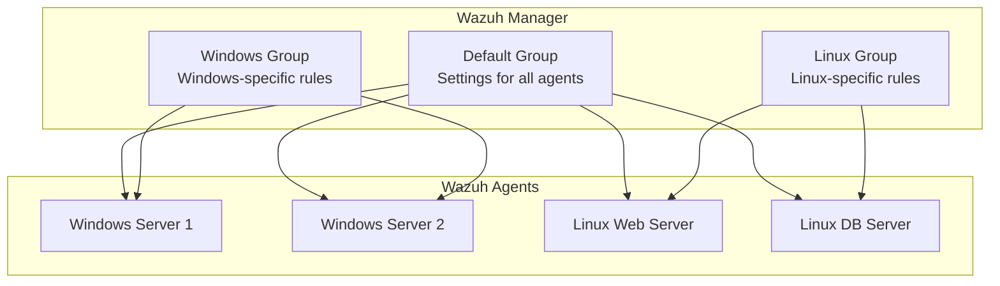

# **Wazuh Centralized Configuration Management Guide**

## **1. Introduction**

This guide explains how to manage Wazuh agent configurations from a central manager. Instead of configuring each agent separately, you can define settings once and apply them to groups of agents.

**Benefits:**
- Consistent security policies across all servers
- Faster deployment of new rules
- Easier management of large environments
- Reduced configuration errors

## **2. How It Works**

### **2.1. Configuration Flow**



**Key Points:**
- All agents get settings from the **Default** group
- Agents also get settings from their specific groups (Windows, Linux, etc.)
- If settings conflict, the more specific group wins

## **3. File Locations**

### **3.1. Where Configurations Are Stored**

```
/var/ossec/etc/shared/
├── default/
│   └── agent.conf           # Settings for ALL agents
├── windows/
│   └── agent.conf           # Windows-only settings
├── linux/
│   └── agent.conf           # Linux-only settings
└── 005.conf                 # Special settings for agent #005
```

## **4. Step-by-Step Guide**

### **4.1. Creating Agent Groups**

**Option A: Using Command Line**
```bash
# Create a new group for web servers
sudo /var/ossec/bin/agent_groups -a -g web-servers

# Create a group for database servers
sudo /var/ossec/bin/agent_groups -a -g db-servers
```

**Option B: Using Web Interface**
1. Go to **Management** → **Groups**
2. Click **Add group**
3. Enter group name (example: `web-servers`)
4. Click **Save**

### **4.2. Adding Agents to Groups**

**Using Command Line:**
```bash
# Add agent #003 to web-servers group
sudo /var/ossec/bin/agent_groups -a -i 003 -g web-servers

# Add multiple agents at once
sudo /var/ossec/bin/agent_groups -a -i 004,005,006 -g web-servers
```

**Using Web Interface:**
1. Go to **Management** → **Groups**
2. Click on your group name
3. Click **Add agent**
4. Select the agents you want
5. Click **Add**

### **4.3. Creating Group Configurations**

1. **Go to the configuration directory:**
   ```bash
   cd /var/ossec/etc/shared/
   ```

2. **Create a folder for your group:**
   ```bash
   sudo mkdir -p web-servers
   ```

3. **Create the configuration file:**
   ```bash
   sudo nano web-servers/agent.conf
   ```

4. **Add your settings (example below) and save the file**

5. **Restart the manager to apply changes:**
   ```bash
   sudo systemctl restart wazuh-manager
   ```

## **5. Practical Examples**

### **5.1. Example: Web Server Monitoring**

**Goal:** Monitor web server files and logs

**Configuration file:** `/var/ossec/etc/shared/web-servers/agent.conf`
```xml
<agent_config>
  <!-- Monitor website files for changes -->
  <syscheck>
    <directories check_all="yes" realtime="yes">/var/www/html</directories>
    <directories check_all="yes">/etc/nginx</directories>
    <directories check_all="yes">/etc/apache2</directories>
    
    <!-- Don't monitor cache files -->
    <ignore>/var/www/html/cache</ignore>
    <ignore>/var/www/html/tmp</ignore>
  </syscheck>
  
  <!-- Monitor web server logs -->
  <localfile>
    <log_format>apache</log_format>
    <location>/var/log/apache2/access.log</location>
  </localfile>
  
  <localfile>
    <log_format>apache</log_format>
    <location>/var/log/apache2/error.log</location>
  </localfile>
</agent_config>
```

### **5.2. Example: Windows Server Security**

**Goal:** Monitor important Windows files and registry

**Configuration file:** `/var/ossec/etc/shared/windows/agent.conf`
```xml
<agent_config>
  <syscheck>
    <!-- Monitor critical system folders -->
    <directories check_all="yes" realtime="yes">C:\Windows\System32</directories>
    <directories check_all="yes">C:\Windows\SysWOW64</directories>
    <directories check_all="yes">C:\Program Files</directories>
    
    <!-- Monitor startup programs -->
    <windows_registry>HKEY_LOCAL_MACHINE\Software\Microsoft\Windows\CurrentVersion\Run</windows_registry>
    <windows_registry>HKEY_CURRENT_USER\Software\Microsoft\Windows\CurrentVersion\Run</windows_registry>
    
    <!-- Don't fill logs with temp file changes -->
    <ignore>C:\Windows\Temp</ignore>
    <ignore>C:\Users\*\AppData\Local\Temp</ignore>
  </syscheck>
</agent_config>
```

### **5.3. Example: Basic Security for All Servers**

**Goal:** Apply essential monitoring to every agent

**Configuration file:** `/var/ossec/etc/shared/default/agent.conf`
```xml
<agent_config>
  <syscheck>
    <!-- Basic file integrity monitoring -->
    <directories check_all="yes">/etc</directories>
    <directories check_all="yes">/bin</directories>
    <directories check_all="yes">/sbin</directories>
    
    <!-- Don't monitor these noisy directories -->
    <ignore>/tmp</ignore>
    <ignore>/var/tmp</ignore>
    <ignore>/dev</ignore>
  </syscheck>
  
  <!-- Monitor system authentication -->
  <localfile>
    <log_format>syslog</log_format>
    <location>/var/log/auth.log</location>
  </localfile>
  
  <localfile>
    <log_format>syslog</log_format>
    <location>/var/log/secure</location>
  </localfile>
</agent_config>
```

## **6. Testing and Verification**

### **6.1. Check if Configuration is Working**

**Verify agent group membership:**
```bash
sudo /var/ossec/bin/agent_groups -l -i 003
```

**Check if agent received configuration:**
```bash
# On the agent machine
sudo tail -f /var/ossec/logs/ossec.log | grep "Configuration received"
```

**Test file monitoring:**
```bash
# Create a test file in a monitored directory
sudo touch /var/www/html/test-file.html

# Check Wazuh dashboard for file change alert
```

### **6.2. Common Problems and Solutions**

**Problem:** Agent not getting new configuration
- **Solution:** Restart the agent: `sudo systemctl restart wazuh-agent`

**Problem:** Configuration errors
- **Solution:** Check XML syntax: `xmllint /var/ossec/etc/shared/group-name/agent.conf`

**Problem:** Agent not connecting to manager
- **Solution:** Check connection: `sudo /var/ossec/bin/agent_control -l -i AGENT_ID`

## **7. Best Practices**

1. **Start Simple:** Put basic settings in the `default` group for all agents
2. **Name Groups Clearly:** Use descriptive names like `web-servers`, `db-servers`, `workstations`
3. **Test First:** Try new configurations on a test agent before applying to production
4. **Monitor Performance:** Too much real-time monitoring can slow down servers
5. **Use Comments:** Add comments to explain why certain settings are used
6. **Backup Configurations:** Save your configuration files in version control

## **8. Quick Reference**

**Common Commands:**
```bash
# List all groups
sudo /var/ossec/bin/agent_groups -l

# List agents in a group
sudo /var/ossec/bin/agent_groups -l -g group-name

# Check agent configuration
sudo /var/ossec/bin/agent_control -i AGENT_ID -c
```

**Common Directories to Monitor:**
- Linux: `/etc`, `/bin`, `/sbin`, `/usr/bin`, `/usr/sbin`
- Windows: `C:\Windows\System32`, `C:\Program Files`, `C:\Program Files (x86)`

**Common Directories to Ignore:**
- Linux: `/tmp`, `/var/tmp`, `/dev`, `/proc`
- Windows: `C:\Windows\Temp`, `C:\Users\*\AppData\Local\Temp`

---

**Need Help?**
- Check agent logs: `/var/ossec/logs/ossec.log`
- Check manager logs: `/var/ossec/logs/ossec.log` (on manager)
- Verify agent is connected: `sudo /var/ossec/bin/agent_control -l`
